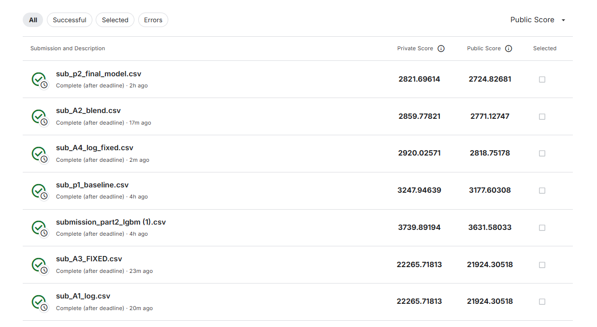

# Walmart Store Sales Forecasting

Kaggle competition: [Walmart Recruiting - Store Sales Forecasting](https://www.kaggle.com/c/walmart-recruiting-store-sales-forecasting)

## Overview
Forecast weekly sales for 45 Walmart stores across 81 departments using 2.5 years of historical data.
Evaluated on **Weighted MAE (WMAE)** — holiday weeks receive 5× weight.

## Approaches

### Part 1 — Seasonal Naïve Baseline
- Shift sales back 52 weeks (same week last year)
- Holiday adjustment: scale holiday-week predictions by historical ratios per event type
- **Kaggle Private WMAE: 3,247.95**

### Part 2 — LightGBM with Feature Engineering
- Lag features: `lag_52`, `lag_51`, `lag_53`
- Rolling statistics: 4-week, 12-week, 52-week mean and std
- Target encoding: per-Store, per-Dept, per-Store×Dept mean and median
- Markdown binary flags (`md_observed`) separating missing from zero-discount weeks
- Holiday type encoding (Super Bowl, Labor Day, Thanksgiving, Christmas)
- Hyperparameter tuning with **Optuna** (15 trials, TPE sampler, MedianPruner)
- 3-fold time-series cross-validation
- Final model trained on **all** available data
- **Kaggle Private WMAE: 2,821.70**

### Appendix A — Further Experiments
| Experiment | Private WMAE | Notes |
|---|---|---|
| 70/30 blend: LightGBM + Seasonal Naïve | 2,859.78 | Slightly worse — model already learned seasonality |
| Fixed log-transform (`log1p` / `expm1`) | 2,920.03 | Slightly worse — dataset has negative sales (returns) that add noise |

## Kaggle Submission History

## Tech Stack
- Python, Pandas, NumPy
- LightGBM, Optuna
- Google Colab (CPU training)
- Kaggle API
